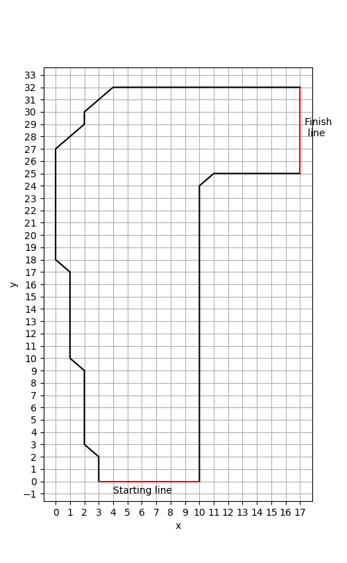
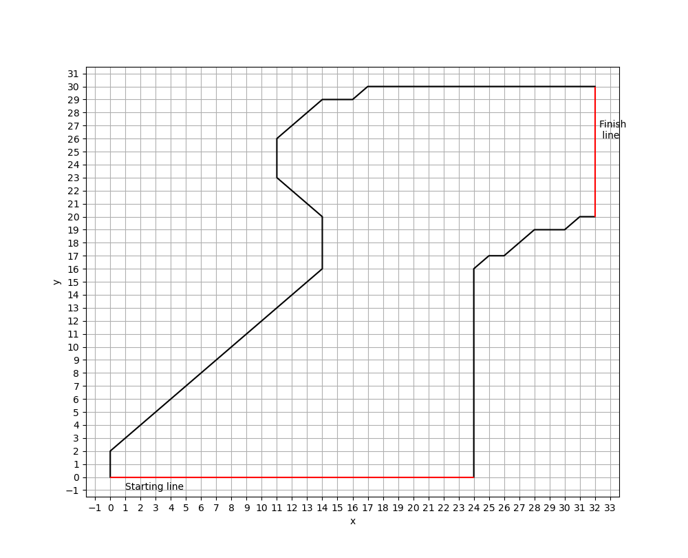

# Introduction

项目的目的是利用**策略梯度法**设计一个驾驶小车在赛道内拐弯的算法，求解小车在赛道中拐弯的最佳策略和值函数，并针对一个赛道，测试算法在不同超参数($\alpha, \epsilon, f(n), s_{\max}, g_{win}, g_{reset}$)下的表现.

# Configuration instructions

代码文件采用 python 语言, 运行前请确认已安装如下的库：

```python
numpy
matplotlib
random
tqdm # 用于显示进度条
copy
```

# Operating instructions

#### Agent 类中可测试的算法

- policy-gradient (decay-epsilon greedy)：对应于文中的 $\epsilon$-greedy (decay) 算法
- policy-gradient (softmax)：对应于文中的 softmax 算法

#### 设置环境参数

track1

```python
trackmap = {
    "left side x": np.array(
        [3] * 3 + [2] * 7 + [1] * 8 + [0] * 10 + [1, 2] + list(range(2, 18))
    ), # 设置左侧赛道的横坐标
    "left side y": np.array(list(range(33)) + [32] * 13), # 设置左侧赛道的纵坐标
    "right side x": np.array([10] * 25 + list(range(11, 18))), # 设置右侧赛道的横坐标
    "right side y": np.array(list(range(25)) + [25] * 7), # 设置右侧赛道的纵坐标
}
```



track2

```python
trackmap = {
    "left side x": np.array(
        [0] * 3
        + list(range(1, 14))
        + [14] * 5
        + [13, 12]
        + [11] * 4
        + list(range(12, 33))
    ),
    "left side y": np.array(list(range(30)) + [29] * 2 + [30] * 16),
    "right side x": np.array([24] * 17 + list(range(25, 33))),
    "right side y": np.array(list(range(18)) + [17, 18] + [19] * 3 + [20] * 2),
}
```



#### 算法测试

```python

# 绘制赛道
plt.ion()
ax = plottrack(trackmap)

# 设置待测试算法的列表，可以由单个或多个agents构成
agent_names = [
    {
        "name": "policy-gradient (decay-epsilon greedy)",
        "trackmap": trackmap,
        "g_reset": -20,
    },
    {
        "name": "policy-gradient (softmax)",
        "trackmap": trackmap,
        "g_reset": -10,
    }
]

# 创建环境类，当传入ax参数时，将绘制小车的行驶路线。图片保存在./image中
env = Environ(trackmap, agent_names, ax, epi=1, simu=1)
# 当测试量较大时，可不传入ax参数，提高运行速度
env = Environ(trackmap, agent_names)

# 开始测试
env.simulation()

# 开始测试，并保存v和pi各变量值的数据
s, piv = env.simulation()
s = np.array(s[0])
piv = np.array(piv[0])
np.save(file="./data/s.npy", arr=s)
np.save(file="./data/piv.npy", arr=piv)
```

#### 算法评估(数据分析的代码见 analysis.py)

```python
# 绘制小车每个回合所用的时间(times)，并保存数据。图片保存在./image中，数据保存在./data中
times = env.evaluate_time() # 当传入数据时，绘制图像并保存: env.evaluate_time(times)
np.save(file="./data/times.npy", arr=times)

# 绘制小车每个回合碰到赛道边界的次数(reset_times)，并保存数据。图片保存在./image中，数据保存在./data中
reset_times = env.evaluate_resetfreq() # 当传入数据时，绘制图像并保存: env.evaluate_resetfreq(reset_times)
np.save(file="./data/reset times.npy", arr=reset_times)
```

# File manifest

**test.py**：测试算法并保存数据

**analysis.py**：评估算法并绘图

**environment.py**：定义环境类

**agent.py**：定义 agent 类

**data**: test.py 生成的数据的存放位置

**image**: test.py 绘制的图片的存放位置

**decay epsilon greedy**: $\epsilon$-greedy (decay) 算法超参数实验的数据和图片

**softmax**: softmax 算法超参数实验的数据和图片

**track2**: track2 实验的数据和图片
